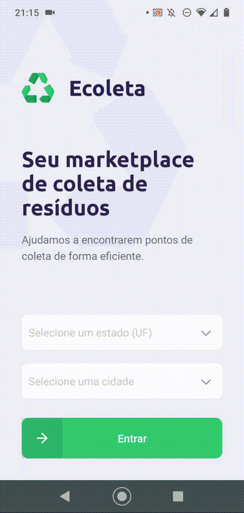

<h1 align="center">
  <p align="center">
    
  </p>
  
  <p align="center">
    Seu marketplace de coleta de resíduos.
  </p>
</h1>

<p align="center">
  ♻ Ajudamos pessoas a encontrarem pontos de coleta de forma eficiente.
</p>

<p align="center">
  <a href="https://www.typescriptlang.org/">
    
  </a>
  <a href="https://nodejs.org/">
    
  </a>
  <a href="https://reactjs.org/">
    
  </a>
  <a href="https://reactnative.dev/">
    
  </a>
  <a href="https://expo.io/">
    
  </a>
</p>

<div align="center">
  
  
</div>

# 📄 Indice

- [Sobre](#-sobre)
- [Tecnologias](#-tecnologias)
- [Como utilizar](#-como-utilizar)

## 📃 Sobre

O __Ecoleta__, é um projeto desenvolvido durante o primeiro NLW (Next Level Week) - uma semana de imersão e conteúdo grátis oferecida pela Rocketseat.

---

## 💻 Tecnologias

Durante a semana tivemos foco prático em desenvolvimento usando as mais recentes ferramentas em desenvolvimento web e mobile, com a stack:

- 🐱‍🏍 **TypeScript** — TypeScript is a typed superset of JavaScript that compiles to plain JavaScript
- ⚛️ **React Js** — A JavaScript library for building user interfaces
- ⚛️ **React Native** — A lib that provides a way to create native apps for Android and iOS
- 💹 **Node Js** — A web framework for Node Js

---

## 👨‍💻 Como utilizar

Primeiramente faça do clone do projeto em um diretório de preferência.

```bash
  # Clonar o repositório
  $ git clone https://github.com/denilsoncamara/ecoleta.git
```
### Projeto backend

```bash
  # Entrar no diretório do projeto backend
  $ cd server

  # Instalar as dependências
  $ yarn install

  # Criar o seu banco
  $ yarn knex:migrate

  # Popular a tabela de itens
  $ yarn knex:seed

  # Iniciar o projeto
  $ yarn dev:server
```

### Projeto web

```bash
  # Entrar no diretório do projeto web
  $ cd web

  # Instalar as dependências
  $ yarn install

  # Iniciar o projeto
  $ yarn start
```

### Projeto mobile

```bash
  # Entrar no diretório do projeto mobile
  $ cd mobile

  # Instalar as dependências
  $ yarn install

  # Iniciar o projeto
  $ yarn start
```

---

🐱‍💻 Desenvolvido por _[Denilson Câmara](https://www.linkedin.com/in/denilsoncamara/)_